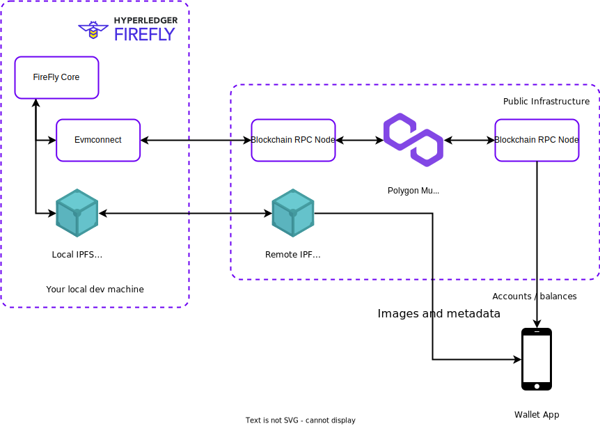
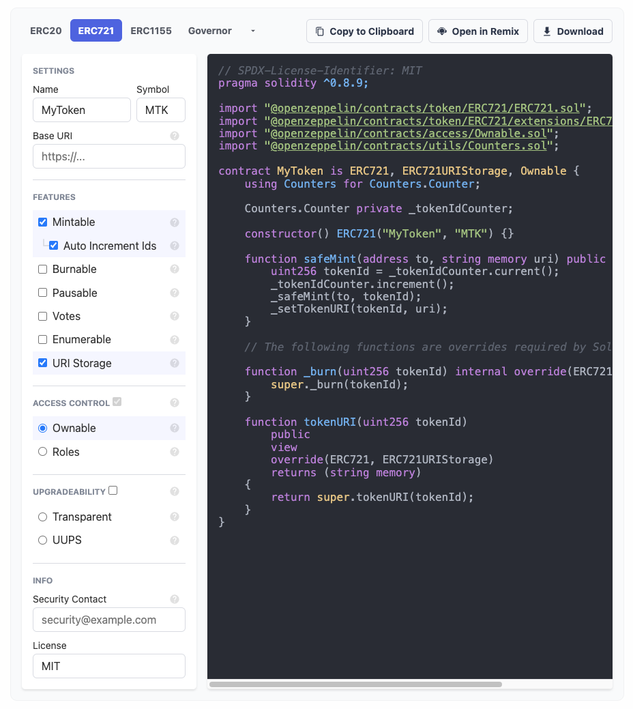
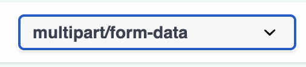
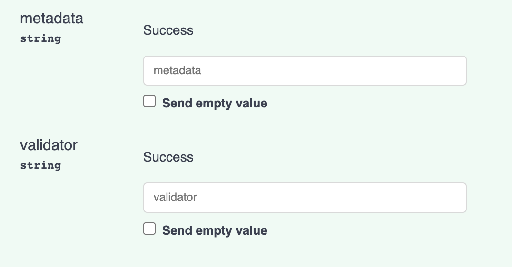

# Use Hyperledger FireFly to launch an NFT collection on a public blockchain

Welcome to the Hyperledger Meetup where we will launch our own NFT collection on a public blockchain! For this workshop we will use the Polygon Mumbai testnet so that we can experiment with a custom token contract and using FireFly to manage it.

## Prerequisites

- An Ethereum wallet app. I recommend [Alpha Wallet](https://alphawallet.com/) as it is open source, supports connecting to testnets, and will show artwork for ERC-721 tokens.
- [Docker](https://www.docker.com/)
- [Docker Compose](https://docs.docker.com/compose/)
- openssl

### Linux Users

> **NOTE**: For Linux users, it is recommended that you add your user to the `docker` group so that you do not have to run `ff` or `docker` as root or with sudo. For more information about Docker permissions on Linux, please see [Docker’s documentation on the topic](https://docs.docker.com/engine/install/linux-postinstall/).

### Windows Users

> **NOTE**: For Windows users, we recommend that you use [Windows Subsystem for Linux 2 (WSL2)](https://docs.microsoft.com/en-us/windows/wsl/). Binaries provided for Linux will work in this environment.

## High level overview of components of the workshop

In this workshop we will:

- Run FireFly on our local machines
- Use FireFly to deploy an ERC-721 smart contract to the Polygon Mumbai testnet
- Use FireFly to upload an image and `metadata.json` to public IPFS
- Mint a token with our smart contract
- Transfer that token to a wallet we can see on a smartphone app



## Install the FireFly CLI

First you will need to get the FireFly CLI set up on your machine. You can follow through the [first page of the Getting Started Guide](https://hyperledger.github.io/firefly/gettingstarted/firefly_cli.html) from the FireFly docs to get it set up.

## Create a new FireFly stack

With the FireFly CLI installed, we can run `ff init` to create your new stack. In order to configure your blockchain connector for use with a public chain, we will want to change a couple of settings. To do this, create a new file at `~/evmconnect.yml` and set the contents to the following:

```yaml
confirmations:
  required: 4 # choose the number of confirmations you require
policyengine.simple:
  fixedGasPrice: null
  gasOracle:
    mode: connector
```

You'll need to have a JSON RPC Node connected to the Polygon testnet. You can either run a node yourself, connect to a free public node, or use a node running service provider. For a list of the JSON RPC methods required by FireFly, please see the [Evmconnect README](https://github.com/hyperledger/firefly-evmconnect#blockchain-node-compatibility)

Use the following command line to create your stack and use the custom blockchain connector config file that we created:

```
ff init ethereum workshop 1 \
    --multiparty=false \
    --ipfs-mode public \
    --blockchain-node remote-rpc \
    --remote-node-url <selected RPC endpoint> \
    --chain-id 80001 \
    --connector-config ~/evmconnect.yml
```

Now you can start up your stack by running:

```
ff start workshop
```

## Get some MATIC to fund your account

While your stack is starting, you can go get some MATIC to be able to pay for transactions on the test chain. First, we need to know your wallet address that your FireFly node is using. We can use the FireFly to retrieve that by running:

### Look up your wallet address

```
ff accounts list workshop | grep address
```

> **NOTE**: We're using `grep` here to only log the address. Without this, the private key would also be logged, which can be useful if you need to know it. However, to not leak private keys for this workshop, we will not be displaying it.

### Use the Polygon Mumbai faucet

Now open a browser and go to https://faucet.polygon.technology/. Paste your wallet address and click "Submit".


### Check your address on Polygonscan

Now you should be able to go to https://mumbai.polygonscan.com/ and search for your wallet address and see some MATIC in your wallet.


## Create a smart contract

Now you can work on creating your own token smart contract. Probably the quickest and easiest way to get started with developing a custom token contract is with the [Open Zeppelin Contracts Wizard](https://docs.openzeppelin.com/contracts/4.x/wizard).

### Open Zeppelin Contracts Wizard

- Select ERC-721
- Select Mintable
- Select Auto Increment Ids
- Select URI Storage
- Give your token a cool name and symbol



At this point, you would likely want to customize the logic in the smart contract or add custom functions to meet the specific needs of your application. It's also really important to thoroughly test your smart contract

### Compile your smart contract

Before you deploy your smart contract to the chain you need to compile it. The Open Zeppelin Contracts Wizard also makes this really easy to do in your browser by giving you the ability to open your smart contract in Remix, which is a fully featured Ethereum smart contract IDE, right in your browser.

Click **Open in Remix**.

Once your contract is opened in the Remix IDE, click the **Compile** button. After compilation, you should see two new small buttons appear at the bottom of that section: **ABI** and **Bytecode**. These will copy portions of the compiled contract to your clipboard. We will need these in the next step.

## Deploy your smart contract

Now we can use FireFly to deploy our smart contract. We can do this right in our browser through the Swagger UI, using the [`/contracts/deploy`](http://127.0.0.1:5000/api#/Default%20Namespace/postContractDeploy) endpoint:

Set the request body to the following, and replace the appropriate sections with the compiled output from Remix:

```
{
  "contract": "PASTE_BYTECODE_HERE",
  "definition": PASTE_ABI_HERE,
  "input": []
}
```

After the transaction has been confirmed we should get a long response. If you scroll down near the bottom, we should see the deployed contract address:

```json
{
  ...
  "output": {
    "contractLocation": {
      "address": "0xfd403b063ecf959867973a4cf383c48b9a06e19e"
    },
  },
  ...
}
```

You should also see the contract deployment event in your [FireFly Explorer web UI](http://127.0.0.1:5000/ui). We can go look up the block number by clicking in to the event and looking at the detailed output. We will need this in a future step.

Alternatively, you should now be able to lookup your contract on [Polygonscan](https://mumbai.polygonscan.com/) and see the block number there as well.

##

> **Additional reading**: If you are interested in more details on using FireFly with an ERC-721 contract, you can read the relevant docs page here: https://hyperledger.github.io/firefly/tutorials/tokens/erc721.html

## Create a contract interface

So far we've only deployed the contract to the chain, which is great. The next step is to teach your FireFly node about your particular contract and all of the methods, parameters, events, and types that it defines. To do that, we need to create a FireFly Interface (FFI) and upload that to FireFly.

### Generate the contract interface

FireFly also provides a convenience API to automatically generate an FFI from an Ethereum ABI. To do that, copy your ABI from Remix (above) and use it to fill in the following request body for the [`/contracts/interfaces/generate`](http://127.0.0.1:5000/api#/Default%20Namespace/postGenerateContractInterface) endpoint:

```json
{
  "input": {
    "abi": PASTE_ABI_HERE
  }
}
```

### Save the contract interface

Copy the entire output from the previous step and use that as the request body for the [`/contracts/interfaces`](http://127.0.0.1:5000/api#/Default%20Namespace/postNewContractInterface) endpoint:

```json
{
  "name": "FILL_IN_A_NAME",
  "version": "FILL_IN_A_VERSION",
  ...
}
```

Note the ID of the generated interface as you will need this in the next step:

```json
{
  "id": "2fd5e1f7-0faf-4d6f-bd9b-9f9003165003"
  ...
}
```

## Create a Token Pool

Now that you've told FireFly about the "shape" of your contract, it's time to tell it to start tracking transactions on this contract. To do that, you create a Token Pool. To do that, use the [`/tokens/pools`](http://127.0.0.1:5000/api#/Default%20Namespace/postTokenPool) endpoint:

```json
{
  "config": {
    "address": "YOUR_DEPLOYED_CONTRACT_ADDRESS",
    "blockNumber": "YOUR_CONTRACT_DEPLOYMENT_BLOCK_NUMBER"
  },
  "interface": {
    "id": "YOUR_INTERFACE_ID"
  },
  "name": "YOUR_TOKEN_NAME",
  "symbol": "YOUR_TOKEN_SYMBOL",
  "type": "nonfungible"
}
```

## Upload token assets

Before minting our first token, we need to upload some assets, namely an image and a `metadata.json`. We will upload the image first, and get the IPFS CID for the image. We will then reference the CID in the `metadata.json` file.

### Upload the image

For this workshop I am going to upload this animated FireFly pixel art. You are welcome to use whatever image you want though.

<p align="center">

</p>

## Use FireFly to upload your image

Your local FireFly stack also has an IPFS node running locally. You can use FireFly's data APIs to upload your NFT image and metadata. You can use the [FireFly Swagger UI](http://127.0.0.1:5000/api#/Default%20Namespace/postData) to upload you image.

> **NOTE**: To upload a file through the Swagger UI, make sure you select `multipart/form-data` from the drop down menu on that endpoint.
>
> 
>
> You will also need to uncheck the bottom two checkboxes for the `metadata` and `validator` fields.
>
> 

When you click **Execute** to upload the file, FireFly should return a payload like this:

```json
{
  "blob": {
    "hash": "string",
    "name": "string",
    "public": "string",
    "size": 0
  },
  "created": "2023-03-16T18:27:00.795Z",
  "datatype": {
    "name": "string",
    "version": "string"
  },
  "hash": "string",
  "id": "3fa85f64-5717-4562-b3fc-2c963f66afa6",
  "namespace": "string",
  "public": "string",
  "validator": "string",
  "value": "string"
}
```

At this point, FireFly has only stored the file in its _private_ data store. To tell FireFly that we would like to make this file available _publicly_, copy the UUID from the `"id"` field in the response above, and call the publish endpoint. You can use the [FireFly Swagger UI](http://127.0.0.1:5000/api#/Default%20Namespace/postDataBlobPublish) to publish the uploaded file to IPFS.

> **NOTE:** Be sure to set the `dataid` field in the path with the ID returned in the previous response. Also clear out all of the `additionalProp` fields in the request body. Your request body should be an empty JSON object: `{}`

FireFly will return a response like this;

```json
{
  "id": "4c2f5ae7-f650-42f3-a586-c84605f333c3",
  "validator": "json",
  "namespace": "default",
  "hash": "5fda07bad90854830cce855ea7d950f6841f420e5aed3bc2f24be0f3fe0a0896",
  "created": "2023-03-16T18:26:44.71439596Z",
  "value": null,
  "blob": {
    "hash": "5fda07bad90854830cce855ea7d950f6841f420e5aed3bc2f24be0f3fe0a0896",
    "size": 27486,
    "name": "",
    "public": "QmWgiVuLF7JVrPkH7nkrEigZoZTQBkUoZwUi32PtPWQdp6"
  }
}
```

Here I can see in the `"public"` field that FireFly has uploaded my image to my local IPFS node its CID is:

```
QmYM6ph25YpDZa2u4joPRhGEjnkHGp9JqZjQDpvdgPZ9Vj
```

Take note of this CID, because we will need to put it in your `metadata.json` file in the next step.

> **NOTE**: It may take some time for your file to be readily accessible from public IPFS gateways. I've seen it take up to 15 minutes to replicate sometimes.

## Create your `metadata.json` file

[EIP-721](https://eips.ethereum.org/EIPS/eip-721) defines an interface for retrieving a URI for a given NFT token index. A common practice is to store the `metadata.json` file on IPFS so it is immutable. The `metadata.json` file for this token looks like this:

```json
{
  "description": "Animated Hyperledger FireFly logo pixel art created by Nicko Guyer",
  "external_url": "https://github.com/hyperledger/firefly",
  "image": "https://ipfs.io/ipfs/QmWgiVuLF7JVrPkH7nkrEigZoZTQBkUoZwUi32PtPWQdp6",
  "name": "Hyperledger FireFly Logo Pixel Art"
}
```

You should create your own `metadata.json` document and be sure that the image URL points to the IPFS CID for your file that you uploaded in the previous step.

## Upload your `metadata.json` file to IPFS

To upload your `metadata.json`, repeat the steps from the section above where you used FireFly's API to upload your image. Make note of the IPFS CID for your `metadata.json` file. In my case, mine was:

```
QmdXtBtB2hTTpop9cSCaTsGigUjiGjJ6TsimMauWKoaqq5
```

For more details on the `metadata.json` format you can refer to [EIP-721](https://eips.ethereum.org/EIPS/eip-721)

## Mint a token

Now we're ready to mint our token! Use the [`/tokens/mint`](http://127.0.0.1:5000/api#/Default%20Namespace/postTokenMint) endpoint and fill in your wallet address and the IPFS CID that represents the metadata for this token.

```json
{
  "amount": "1",
  "to": "YOUR_FIREFLY_WALLET_ADDRESS",
  "uri": "ipfs://YOUR_IPFS_CID"
}
```

> **NOTE**: You could have FireFly mint the token to its own wallet, and then transfer it at a later time, or you could mint it directory to another wallet that you own.

## Transfer your token

You can also use FireFly's API to easily transfer any tokens owned by your node's wallet. For example, if you transfer your token to your AlphaWallet address, you should be able to see your shiny new token in your wallet app. You can use the [`/tokens/transfers`](http://127.0.0.1:5000/api#/Default%20Namespace/postTokenTransfer) endpoint with a payload like this:

```json
{
  "amount": "1",
  "from": "SENDER_ADDRESS",
  "to": "RECIPIENT_ADDRESS",
  "tokenIndex": "1"
}
```

> **NOTE**: You will need to enable testnets in AlphaWallet and specifically enable Mumbai to see your token
